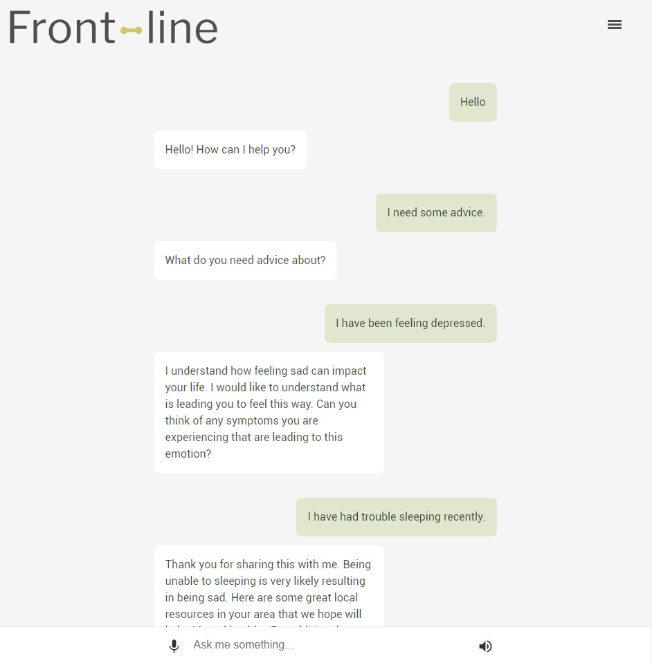

___

# Website

Website for an interactive chatbot which provides personalized and localized support for those who are one-degree from veterans and those vulnerable to PTSD.

View the website here: https://lumohacks2018.github.io/

Learn more about the project here: https://lumohacks2018.github.io/about.html



## Setup

The website is created with Vue.js and the HTML pages can be viewed without prior setup. After making changes to the Javascript or the configuration, though, the project needs to be set up and built before the changes will be reflected.

To set up the project locally, install NPM and run:
```
npm install
```

To temporarily build and start up the website locally at `http://localhost:8080`, run:
```
npm run dev
```

To build the website to view it normally, run:
```
npm run build
```

This should be run before committing, if the Javascript or configuration has been changed.

### Reconfiguration

To change the website to use another Dialogflow agent, edit the configuration in `config.js` and change `app.token` to the appropriate client access token.

To find the client access token for your agent in Dialogflow, click the gear wheel to navigate to the settings. Under the _General_ tab, scroll down to find the token.